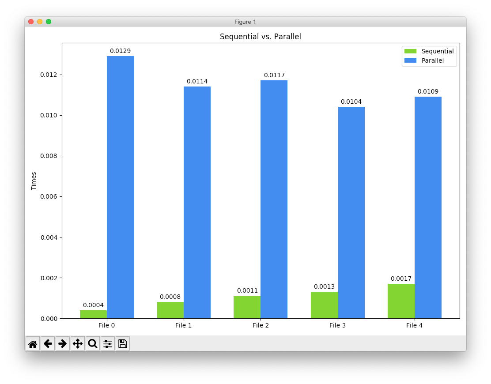
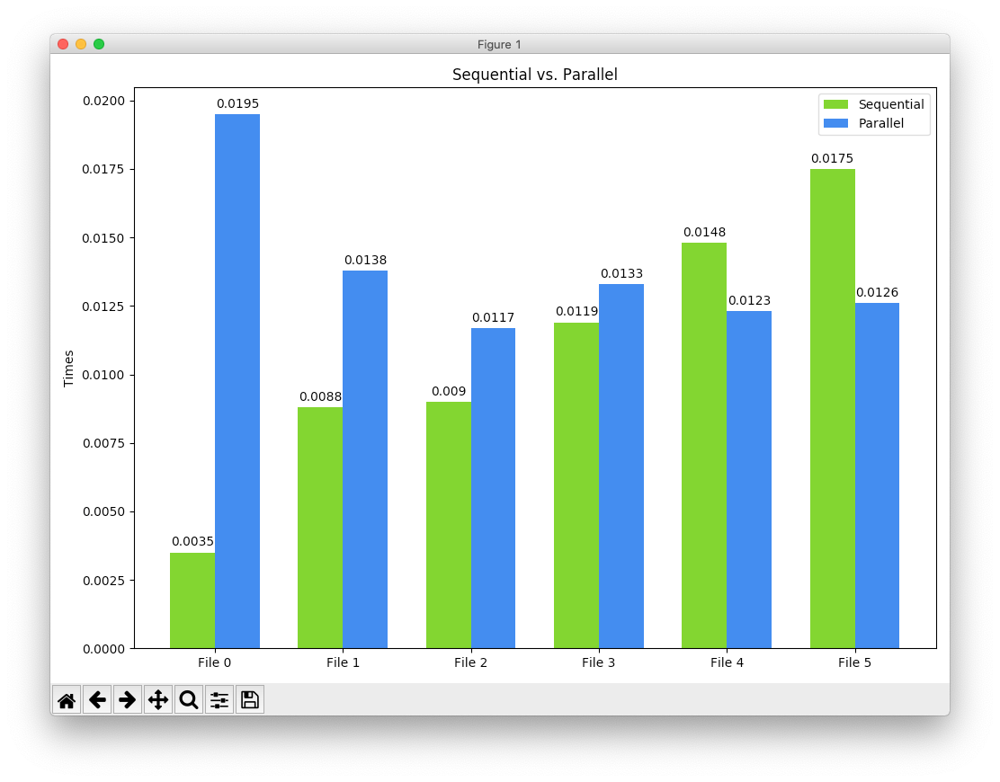

# ParallelLinter

## Parentheses, Brackets, and Braces Matching Linter

Matches ( ) [ ] { } symbols to be used as a JavaScript Linter.

Tells you what the error was and which line it occurs on.

### Description

#### Sequential

Implements a stack that gets added to each time an opening character is found - i.e. (, [, or {. If a closing character is found and that character does not match the top character of the stack or if the stack is empty, then it is determined that there is an error and the program looks to see if that is because there is an extra closing character or if there was a missing opening character.

#### Parallel

Works by splitting the read in file into roughly equally sized chunks and passing them to the match finding algorithm as seperate processes that are run at the same time. This finds only the characters that do not have matches in their chunks and then runs through the pair matching algorithm again to see if their pairs exist in one of the other chunks.

### Performance Comparison

The sequential algorithm tends to outperform the parallel algorithm in shorter files. Shown in the image below

However, when the files get very large, the times get to be more comparable. After a threshold of about 500 lines worth of JavaScript code, then the parallel algorithm will begin to consistently outperform the sequential version.

